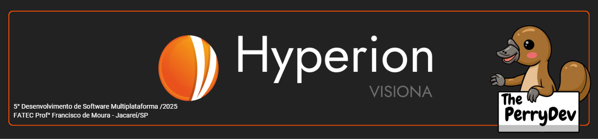

<br id="topo">

<p align="center"> </p>

<p align="center">
    <a href="#sobre">Sobre</a>  |  
    <a href="#executando">Executando o Projeto</a>  |  
    <a href="#clonando">Clonando o Repositório</a>  | 
    <a href="#backend">Execução Backend</a>  |    
    <a href="#frontend">Execução Frontend</a>  |  
    <a href="#estrutura">Estruturação Básica</a>
</p>

<span id="sobre">

## :bookmark_tabs: Sobre o projeto

A partir da apresentação do pedido dado pela empresa Visiona, a solução apresentada pela empresa The Perry Devs consiste no desenvolvimento de aplicações web para mapeamento automático de cicatrizes de queimadas em imagens do sensor WFI a bordo dos satélites CBERS4, CBERS4A e Amazônia 1, permitindo o monitoramento de áreas afetadas por queimadas com maior eficiência e precisão na geração de dados críticos para gestores ambientais, pesquisadores e formuladores de políticas públicas.

<span id="executando">

## :computer: Como Executar o Projeto

<span id="clonando">

### :inbox_tray: Clonando o Repositório

Para clonar o repositório do projeto em sua máquina local, siga os passos abaixo:

1. Abra o terminal (ou prompt de comando) da sua preferência.

2. Navegue até o diretório onde deseja salvar o projeto.

3. Execute o seguinte comando:

```bash
git clone https://github.com/ThePerryDev/Hyperion-project.git
```

<span id="backend">

### ⚙️ Backend

Para rodar o backend localmente, siga os passos abaixo. Certifique-se de ter o [Python](https://www.python.org/downloads/) e o [PostgreSQL](https://www.postgresql.org/download/) instalados na sua máquina.

> ⚠️ **Importante:** Por enquanto, é necessário criar manualmente o banco de dados no PostgreSQL antes de iniciar a aplicação.

### 🚀 Passo a Passo para Execução do Backend

1. Acesse a pasta `backend`:

```bash
cd backend
```

2. Crie e ative o ambiente virtual:

```bash
py -m venv ../venv
../venv/Scripts/activate
```

3. Instale as dependências (estando na pasta `backend`):

```bash
pip install -r requirements.txt
```

4. Faça o mesmo na pasta app (estando na pasta `backend`):

```bash
cd app
pip install -r requirements.txt
```

5. Configure o banco de dados manualmente no PostgreSQL.

Crie um banco com o nome `Hyperion`.

6. Edite o arquivo `.env` com as configurações de seu POSTGRES:

```
POSTGRES_USER=postgres
POSTGRES_PASSWORD=123
POSTGRES_DB=Hyperion
POSTGRES_HOST=localhost
POSTGRES_PORT=5432
```

7. Inicie o servidor FastAPI (estando na pasta `backend`):

```bash
cd..
uvicorn app.main:app --reload
```

A aplicação estará disponível em: [http://localhost:8000](http://localhost:8000)

<span id="frontend">

### 💻 Frontend

Para rodar o frontend localmente, siga os passos abaixo. Certifique-se de ter o [Node.js (que já inclui o npm)](https://nodejs.org/pt/download) instalado na sua máquina.

### 🚀 Passo a Passo para Execução do Frontend

1. Acesse a pasta frontend:

```bash
cd frontend
```

2. Instale as dependências do projeto:

```bash
npm install
```

3. Inicie a aplicação React:

```bash
npm start
```

A aplicação estará disponível em: [http://localhost:3000](http://localhost:3000)

> ℹ️ Por padrão, o React utilizará a porta 3000. Certifique-se de que ela esteja disponível ou será sugerido automaticamente o uso de outra porta.

<span id="estrutura">

### 📁 Estrutura Básica do Projeto

```bash
📦 Hyperion-project                              # ← Raiz do repositório
┣ 📂 backend                                     # ← Diretório do backend (FastAPI)
┃ ┣ 📂 alembic                                   # ← Migrations do banco de dados com Alembic
┃ ┣ 📂 app                                       # ← Aplicação principal FastAPI
┃ ┃ ┣ 📂 controllers                             # ← Lógica dos controladores (camada intermediária entre rotas e serviços)
┃ ┃ ┣ 📂 core                                    # ← Configurações centrais da aplicação (ex: settings, auth, startup)
┃ ┃ ┣ 📂 models                                  # ← Definição dos modelos ORM (SQLAlchemy)
┃ ┃ ┣ 📂 routes                                  # ← Definição das rotas da API
┃ ┃ ┣ 📂 schemas                                 # ← Validações e contratos de dados (Pydantic)
┃ ┃ ┣ 📂 services                                # ← Lógica de negócio da aplicação
┃ ┃ ┣ 📂 utils                                   # ← Funções auxiliares e utilitárias
┃ ┃ ┣ 📜 main.py                                 # ← Arquivo principal que inicia a aplicação FastAPI
┃ ┃ ┗ 📜 requirements.txt                        # ← Dependências do backend
┃ ┣ 📜 .env                                      # ← Variáveis de ambiente (ex: URL do banco de dados)
┃ ┣ 📜 .gitignore                                # ← Arquivos ignorados pelo Git no backend
┃ ┣ 📜 alembic.ini                               # ← Configuração do Alembic
┃ ┗ 📜 requirements.txt                          # ← (Duplicado — talvez unificar com o da pasta `app`)
┣ 📂 frontend                                    # ← Diretório do frontend (React + TypeScript)
┃ ┣ 📂 public                                    # ← Arquivos públicos servidos diretamente (HTML, favicon)
┃ ┃ ┣ 📜 favicon.ico                             # ← Ícone do navegador
┃ ┃ ┗ 📜 index.html                              # ← HTML base onde o React é montado
┃ ┣ 📂 src                                       # ← Código-fonte da aplicação React
┃ ┃ ┣ 📂 assets                                  # ← Imagens e arquivos estáticos utilizados na UI
┃ ┃ ┣ 📂 components                              # ← Componentes reutilizáveis da interface
┃ ┃ ┣ 📂 context                                 # ← Contextos globais (React Context API)
┃ ┃ ┣ 📂 hooks                                   # ← Hooks personalizados para lógica reutilizável
┃ ┃ ┣ 📂 pages                                   # ← Páginas da aplicação (normalmente vinculadas às rotas)
┃ ┃ ┣ 📂 routes                                  # ← Definição de rotas (React Router, etc)
┃ ┃ ┣ 📂 services                                # ← Serviços de integração com APIs
┃ ┃ ┣ 📂 types                                   # ← Tipagens TypeScript globais ou compartilhadas
┃ ┃ ┣ 📂 utils                                   # ← Funções auxiliares reutilizáveis
┃ ┃ ┣ 📜 App.tsx                                 # ← Componente raiz da aplicação React
┃ ┃ ┣ 📜 custom.d.ts                             # ← Arquivo de definições customizadas para o TypeScript
┃ ┃ ┣ 📜 index.tsx                               # ← Ponto de entrada da aplicação React (renderização do App)
┃ ┃ ┗ 📜 react-app-env.d.ts                      # ← Arquivo de ambientação para o React com TypeScript
┃ ┣ 📜 .gitignore                                # ← Arquivos ignorados pelo Git no frontend
┃ ┣ 📜 package-lock.json                         # ← Versões travadas das dependências (gerado pelo npm)
┃ ┣ 📜 package.json                              # ← Configuração do projeto React e dependências
┃ ┗ 📜 tsconfig.json                             # ← Configurações de compilação do TypeScript
┣ 📂 Imagens_md                                  # ← Imagens utilizadas na documentação Markdown do projeto
┗ 📜 README.md                                   # ← Documento principal com instruções e visão geral do projeto
```

→ [Voltar ao topo](#topo)
